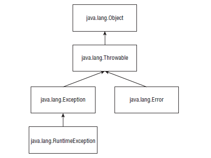

# Exceptions

A classe principal é classe *Throwable*. Todos erros de execução são dessa classe ou de uma classe filha.
Suas classes filhas são: *Error* e *Exception*, conforme ilustra a figura abaixo.



## Error

São erros gerados por uma situação totalmente anormal que não devem ser previstos pela aplicação. Como exemplo, temos *OutOfMemoryError* que é gerado quando a JVM não tem mais memória RAM disponível para entregar para a aplicação.

## Exception

Por outro lado, *Exceptions* são erros de responsabilidade da aplicação, então elas devem tratar ou evitar. *SQLException* é gerado quando um erro ocorre entre na comunicação entre a aplicação e o banco de dados. 
As exceptions são divididas em duas categorias: ***uncheckeds*** e ***checkeds***.  

As ***uncheckeds*** são exceptions que teoricamente podem ser evitadas codificando de forma defensiva. Elas são definidas pelas classes que extendem *RuntimeException*, filha de *Exception*. Estas exceptions, como o próprio nome diz não são checadas pelo compilador se estão sendo tratadas.

As ***checkeds*** são exceptions que precisam ser tratadas, portanto verificadas pelo compilador se está sendo feito o tratamento de alguma maneira. Estas exceptions são definidas pelas classes que extendem *Exception*.
Há uma restrição em relação ao uso try-catch para este tipo de exceptions: somente pode ser feito try-catch se o código do bloco pode realmente lançar a checked exception em questão. Confira o erro no exemplo abaixo:

```java
try {
    System.out.println("não acontece SQLException");
} catch(java.sql.SQLException e){
    // pegando SQLException, erro de compilação.
    // tratamento de SQLException.
}
```
Existem situações onde é necessário executar comandos independente de ocorrer a exception. Para isso existe o bloco *finally*. Não importa o que ocorre, no final a conexão com o banco de dados deve ser fechada. Veja como:

```java
void method(){
    try {
        abreConexao();
        fazConsultas();
        // Não precisa mais fechar a conexao aqui
    } catch(SQLException e) {
        // tratamento de SQLException
    } finally {
        fechaConexao(); // independetemente de sucesso ou
        // fracasso, fecha a conexão
    }
}
```
parado na pag 372